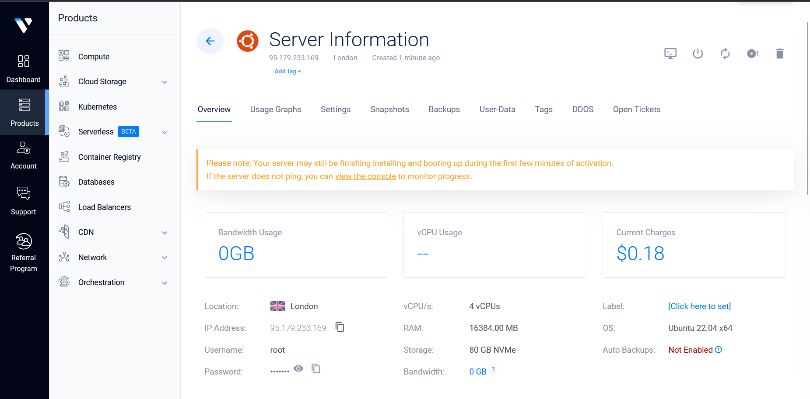
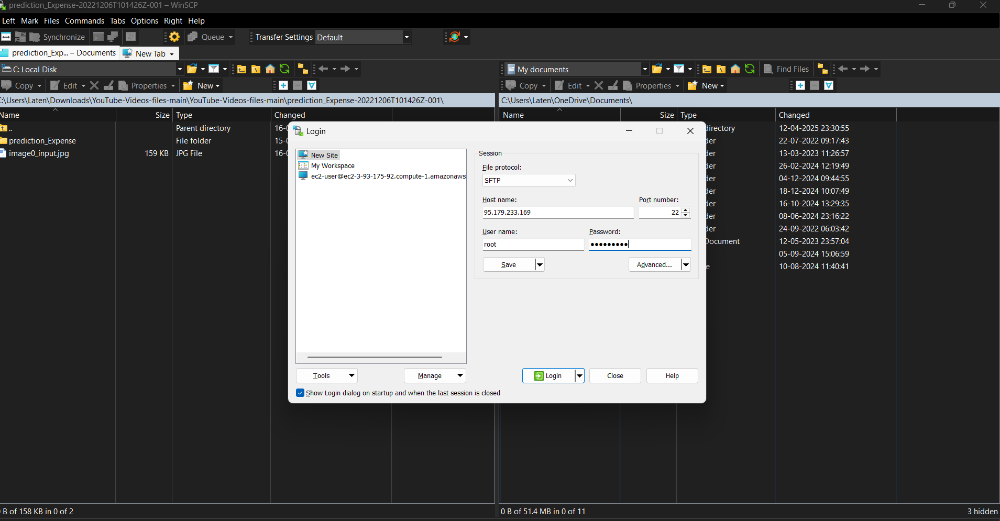
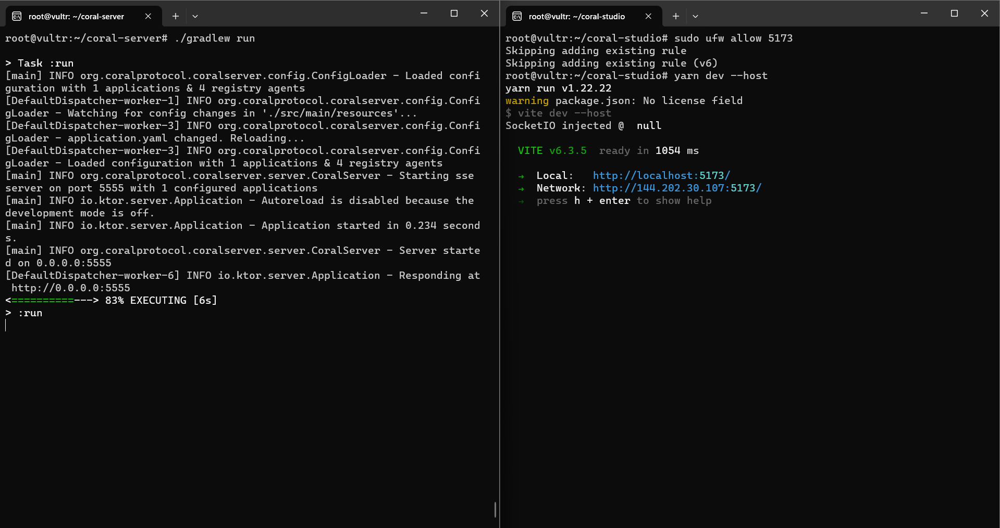
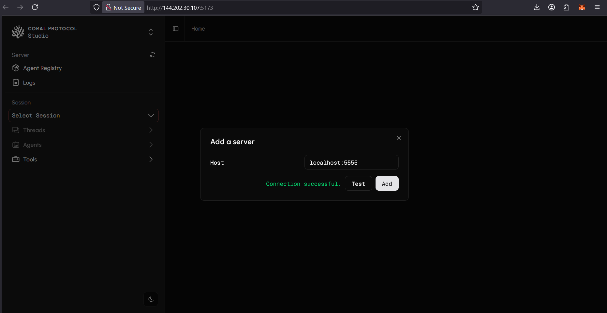
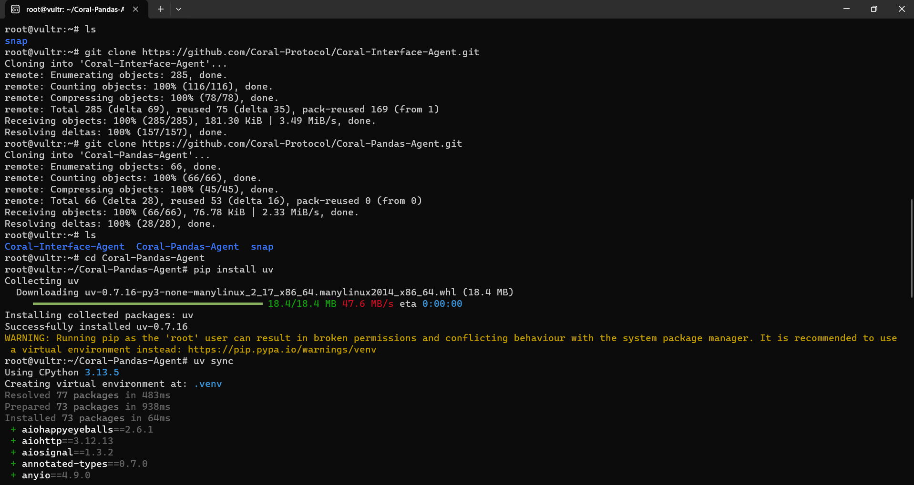
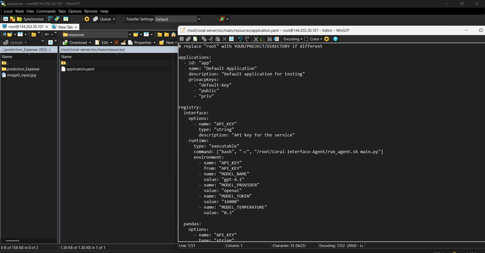
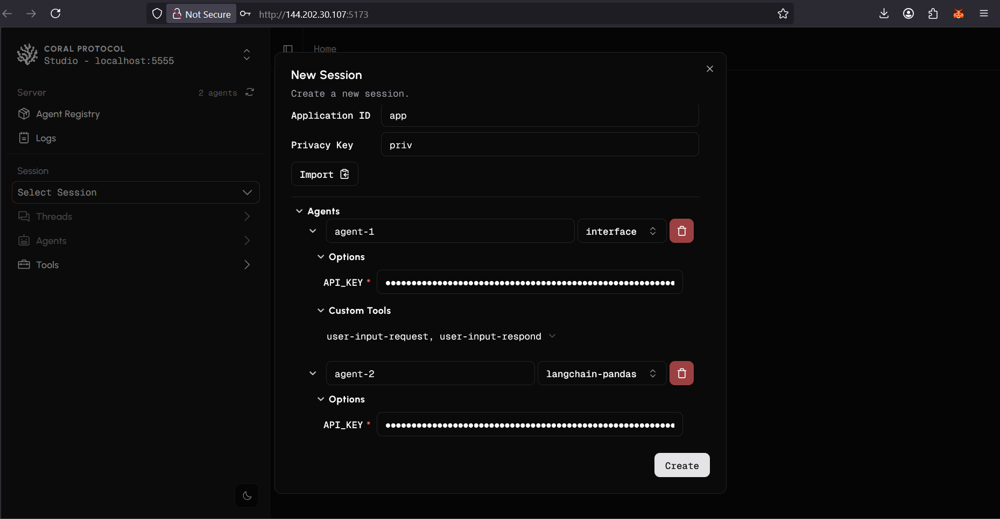

# Coral Raise Your Hack Guide

## About Raise Your Hack 💻
This is your chance to push boundaries, solve real-world challenges, and create impact at the official hackathon of the [RAISE Summit 2025](https://www.raisesummit.com/) at one of Paris's most iconic venues: Le Carrousel du Louvre. RAISE Summit 2025 is a premier event convening the brightest minds across industries to accelerate innovation and drive the future of entrepreneurship, AI, and technology.

## About Coral Protocol 🪸

The [Coral Protocol](https://www.coralprotocol.org/) is an initiative to create an open, standardized infrastructure for AI agent coordination. It builds on the MCP framework to enable multiple AI agents to work together collaboratively, addressing the limitation of isolated AI systems that lack mechanisms for interconnected workflows. The Coral Protocol focuses on:

- Agent Collaboration: Allowing AI agents to communicate, share tasks, and coordinate in a structured way.

- Messaging Layer: Providing a system for agents to exchange messages, similar to human messaging platforms, with features like threads and mentions.

- Scalability and Openness: Designing an extensible, open-source solution that can support a wide range of AI applications, from customer support to project management.

We released the [Coral Server](https://github.com/Coral-Protocol/coral-server) as an open-source MCP server to serve as the backbone for this vision. The server acts as a messaging hub where AI agents can register, communicate via threads, and coordinate tasks by mentioning each other. The protocol aims to foster a community-driven ecosystem, encouraging developers to experiment, contribute, and build collaborative AI systems.

## About the Tracks 🎯

Coral Protocol is encouraged for teams interested in multi-agent systems, allowing them to integrate open-source agents from any framework. With its thread-based agent architecture, Coral enables scalable and predictable multi-agent interactions, making it a powerful tool for innovative applications. Checkout how to build on the below track using Coral Protocol.

### Vultr Track

🧠 Agentic Workflows for the Future of Work

<details>

Build a Web-Based Enterprise Agent Deployed on Vultr

In this track, you'll design and develop a web-based AI agent purpose-built to support enterprise teams—from marketing to sales, operations, and beyond. Your mission: create a smart, agentic tool that simplifies, accelerates, or transforms workflows for today’s (and tomorrow’s) knowledge workers. The core app should be deployed on Vultr infrastructure and optimized for real-world business use cases.

🔍 What We’re Looking For:
• Enterprise-Ready: Your agent should address pain points or opportunities within marketing, sales, customer success, HR, or other enterprise functions.

• Agentic & Autonomous: Move beyond simple prompts. Build workflows where the agent can reason, plan, and act with minimal human input. Think multi-step tasks, decision trees, and feedback loops.

• Future-of-Work Focused: Help teams save time, make smarter decisions, or enhance collaboration—through the lens of what future employee experience could look like.

• Web-Based & Deployed on Vultr: The app must be a deployable web app running on Vultr. You can use any stack, language, or framework, but it should be cloud-hosted and publicly accessible (Vultr credits will be provided).

• Scalable Tooling: We encourage—but don’t require—use of technologies like vector databases, model context protocol (MCP), or other modular, scalable AI components.

🛠️ Tech Flexibility:
• Use any programming language or framework.
• Use open-source LLMs, retrieval-augmented generation. (Also available via Vultr Serverless Inference)

📦 Developer Expectations:
• Include a GitHub repo with setup instructions, agent capabilities, and a sample use case demo.
• Deploy on Vultr (we’ll provide credits and assistance).
• Show how your app solves a real problem in an enterprise context.

Each team leader of the Vultr Track will receive a coupon code to claim $250 in free credits on Vultr by signing up as a regular customer.

</details>

### Vultr Track: How to setup Coral on Vultr

<details>

### 1. Set up Vultr

<details>

- Sign up on Vultr and know more by looking into the [product documentation](https://docs.vultr.com/products)

- Choose and host an instance as per your system requirements (Ubuntu: 22.0.4 recommended)



- Open terminal in your laptop, SSH into the instance (check IP) and enter the password of your instance

```bash
ssh root@95.179.233.169
```
- It is also useful to connect to same instance by [WinSCP](https://winscp.net/eng/index.php) which can help edit files within your server. Connect using your Vultr credentials after installation.



</details>

### 2. Setup Coral Server and Coral Studio

<details>

- After you are logged into Vultr from your terminal, it is time to setup the [Coral Server](https://github.com/Coral-Protocol/coral-server) and [Coral Studio UI](https://github.com/Coral-Protocol/coral-studio). Follow the steps given in repository to install.

- In order to test if both are working, open the same instance in two terminals and run both simultaneously.

- Ensure the server’s firewall allows incoming connections on port 5173 (or the port Studio is using). You may need to open this port using a command like

```bash

# allow external port access
sudo ufw allow 5173

# run studio using --host
yarn dev --host
```
- You will see both running like this simultaneously if succesful and should be able to access Coral Studio from your browser.



- On Coral Studio, ensure the connection to Coral Server.



<details>

<summary>Install yarn if UNAVAILABLE in order to run Coral Studio</summary>

```bash
# Download and install nvm:
curl -o- https://raw.githubusercontent.com/nvm-sh/nvm/v0.40.3/install.sh | bash

# in lieu of restarting the shell
\. "$HOME/.nvm/nvm.sh"

# Download and install Node.js:
nvm install 22

# Verify the Node.js version:
node -v # Should print "v22.17.0".
nvm current # Should print "v22.17.0".

# Download and install Yarn:
corepack enable yarn

# Verify Yarn version:
yarn -v
```
</details>

</details>

### 3. Setup the Agents


<details>  

- Terminate the Coral Server and Coral Studio connections from above and start below steps.
- In this example, we are using the agents: [Coral Interface Agent](https://github.com/Coral-Protocol/Coral-Interface-Agent) and [Coral Pandas Agent](https://github.com/Coral-Protocol/Coral-Pandas-Agent).  
- Please click on the link and set up the agents by following the setup instructions in the repository.  
- Check the output below to see how the terminal will look after succesfull installation, keep in mind the directory you are at while doing `uv sync`.



</details>

### 4. Run the Agents

<details>

<summary>You can run in either of the below modes to get your system running.</summary>

#### 1. Executable Mode

<details>

- The Executable Mode is part of the Coral Protocol Orchestrator which works with [Coral Studio UI](https://github.com/Coral-Protocol/coral-studio).  

- Checkout: [How to Build a Multi-Agent System with Awesome Open Source Agents using Coral Protocol](https://github.com/Coral-Protocol/existing-agent-sessions-tutorial-private-temp).  

- Update the file: `coral-server/src/main/resources/application.yaml` with the details below. You can use WinSCP to make change in the file by copying the below command.

  

<details>

<summary>Expand this to update `application.yaml` with this code</summary>

```bash
# replace "root" with YOUR/PROJECT/DIRECTORY if different
# update model according to requirement

applications:
  - id: "app"
    name: "Default Application"
    description: "Default application for testing"
    privacyKeys:
      - "default-key"
      - "public"
      - "priv"

registry:
  interface:
    options:
      - name: "API_KEY"
        type: "string"
        description: "API key for the service"
    runtime:
      type: "executable"
      command: ["bash", "-c", "/root/run_agent.sh main.py"]
      environment:
        - name: "API_KEY"
          from: "API_KEY"
        - name: "MODEL_NAME"
          value: "llama-3.3-70b-versatile"
        - name: "MODEL_PROVIDER"
          value: "groq"
        - name: "MODEL_TOKEN"
          value: "16000"
        - name: "MODEL_TEMPERATURE"
          value: "0.3"
          
  langchain-pandas:
    options:
      - name: "API_KEY"
        type: "string"
        description: "API key for the service"
    runtime:
      type: "executable"
      command: ["bash", "-c", "/root/run_agent.sh main.py"]
      environment:
        - name: "API_KEY"
          from: "API_KEY"
        - name: "MODEL_NAME"
          value: "llama-3.3-70b-versatile"
        - name: "MODEL_PROVIDER"
          value: "groq"
        - name: "MODEL_TOKEN"
          value: "16000"
        - name: "MODEL_TEMPERATURE"
          value: "0.3"


```

</details>

- Run the [Coral Server](https://github.com/Coral-Protocol/coral-server) and [Coral Studio](https://github.com/Coral-Protocol/coral-studio). 

- You do not need to set up the `.env` in the project directory for running in this mode; it will be captured through the variables below.  

- After the agents are loaded properly, you will see "2 agents" connected. Proceed ahead with "Select Session", add the agents, api key and esure to add both the Custom Tools to the Interface Agent.

  

</details>

#### 2. Dev Mode

<details>

- The Dev Mode allows the Coral Server and all agents to be seaprately running on each terminal without UI support.  

- Ensure that the [Coral Server](https://github.com/Coral-Protocol/coral-server) is running on your system and run below commands in separate terminals.

- Ensure that you have setup the `.env` file with required keys.  

Run the Interface Agent

```bash
# cd to directory
cd Coral-Interface-Agent

# Run the agent using `uv`:
uv run python main.py
```

Run the Pandas Agent

```bash
# cd to directory
cd Coral-Pandas-Agent

# Run the agent using `uv`:
uv run python main.py
```

</details>

</details>

## Example 

</details>

(NOTE: The examples above are just to demonstrate how to use Coral. For the hackathon you have to create you own use case by either selecting from the list of agents from our [awesome agent list](https://github.com/Coral-Protocol/awesome-agents-for-multi-agent-systems) or create your own agents compatible on Coral.)

