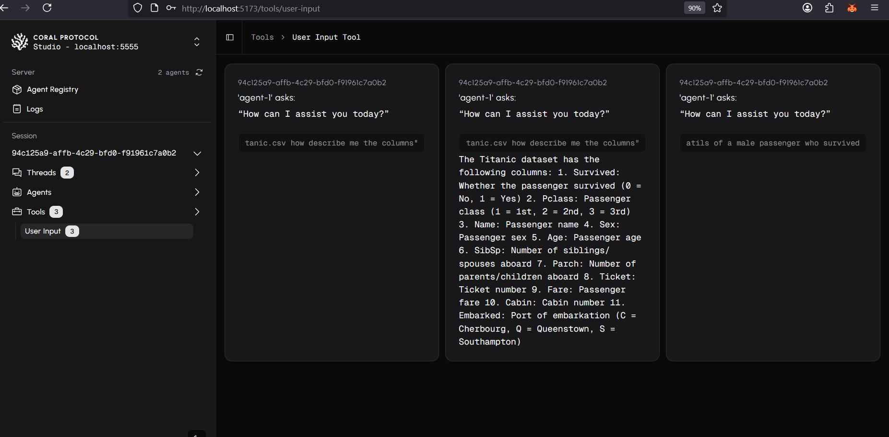

# Vultr Enterprise Spreadsheet Automation
 This guide helps you build an Enterprise Spreadsheet Automation app for the Vultr Challenge using Coral Protocol and multi-agent collaboration. Follow step-by-step setup instructions for agents, server, and UI.


### Introduction

- The Vultr Track challenges you to build a web-based enterprise AI agent deployed on Vultr’s cloud infrastructure using the Coral Protocol, an open, standardized framework for AI agent collaboration. Coral enables multiple AI agents to communicate, share tasks, and coordinate through a structured messaging layer with threads and mentions. 

- The purpose of this track is is to show how to setup and run Coral using Vultr Cloud and a simple demonstration of an agentic system to answer any queries with respect to any spreadsheet. The app reqquires either a spreadsheet and a folder path or upload in Drive or GitHub and provide a public URL.

- In this example we are using the Titanic spreadsheet: `https://raw.githubusercontent.com/pandas-dev/pandas/main/doc/data/titanic.cs`.

- Agents:  [Coral Interface Agent](https://github.com/Coral-Protocol/Coral-Interface-Agent) | [Coral Pandas Agent](https://github.com/Coral-Protocol/Coral-Pandas-Agent)

- [Demo video](https://drive.google.com/file/d/1JlGDdraESduyIm44QvnJT2aiUzaRoi02/view?usp=sharing)

### Outline

- **Setup Vultr**
   Step-by-step guide to setup Vultr 

- **Setup Coral Server and Coral Studio**  
  Step-by-step guide to install and run Coral Server and Coral Studio with necessary dependencies (Java, Yarn, Node.js).

- **Setup the Agents**  
  Instructions to install and configure the Interface Agent and Restaurant Voice Agent using uv.

- **Run the Agents**  
  Available options to run agents:
  - Executable Mode with Coral Studio Orchestrator  
  - Dev Mode (terminal-based) for easier debugging  

- **Example**
  Sample input and output to get results.

### How to run step by step

### 1. Set up Vultr

<details>

- Sign up on Vultr and know more by looking into the [product documentation](https://docs.vultr.com/products)

- Choose and host an instance as per your system requirements (Ubuntu: 22.0.4 recommended)


- Open terminal in your laptop, SSH into the instance (check IP) and enter the password of your instance

```bash
ssh root@95.179.233.169
```
- It is also useful to connect to same instance by [WinSCP](https://winscp.net/eng/index.php) which can help edit files within your server. Connect using your Vultr credentials after installation.


</details>

### 2. Setup Coral Server and Coral Studio

<details>

- After you are logged into Vultr from your terminal, it is time to setup the [Coral Server](https://github.com/Coral-Protocol/coral-server) and [Coral Studio UI](https://github.com/Coral-Protocol/coral-studio). Follow the steps given in repository to install.

<details>

<summary>Install Java if UNAVAILABLE in order to run Coral Server</summary>

Install Java

```bash

# Apt update
sudo apt update

# Install the JDK
sudo apt install openjdk-17-jdk

# Check version
java -version
```

Run Coral Server

```bash

./gradlew run

```

</details>

<details>

<summary>Install Yarn if UNAVAILABLE in order to run Coral Studio</summary>

Install Yarn

```bash
# Download and install nvm:
curl -o- https://raw.githubusercontent.com/nvm-sh/nvm/v0.40.3/install.sh | bash

# in lieu of restarting the shell
\. "$HOME/.nvm/nvm.sh"

# Download and install Node.js:
nvm install 22

# Verify the Node.js version:
node -v # Should print "v22.17.0".
nvm current # Should print "v22.17.0".

# Download and install Yarn:
corepack enable yarn

# Verify Yarn version:
yarn -v

# Install from yarn
yarn install

# Allow port for eternal access
sudo ufw allow 5173

```

Run Coral Studio

```bash

yarn dev --host

```

</details>

- In order to test if both are working, open the same instance in two terminals and run both simultaneously.

- Ensure the server’s firewall allows incoming connections on port 5173 (or the port Studio is using). You may need to open this port using a command like

```bash

# allow external port access
sudo ufw allow 5173

# run studio using --host
yarn dev --host
```
- You will see both running like this simultaneously if succesful and should be able to access Coral Studio from your browser.


- On Coral Studio, ensure the connection to Coral Server.


</details>

### 3. Setup the Agents


<details>  

- Terminate the Coral Server and Coral Studio connections from above and start below steps.
- In this example, we are using the agents: [Coral Interface Agent](https://github.com/Coral-Protocol/Coral-Interface-Agent) and [Coral Pandas Agent](https://github.com/Coral-Protocol/Coral-Pandas-Agent).  
- Please click on the link and set up the agents by following the setup instructions in the repository.  
- Check the output below to see how the terminal will look after succesfull installation, keep in mind the directory you are at while doing `uv sync`.


</details>

### 4. Run the Agents

<details>

<summary>You can run in either of the below modes to get your system running.</summary>

#### 1. Executable Mode

<details>

- The Executable Mode is part of the Coral Protocol Orchestrator which works with [Coral Studio UI](https://github.com/Coral-Protocol/coral-studio).  

- Checkout: [How to Build a Multi-Agent System with Awesome Open Source Agents using Coral Protocol](https://github.com/Coral-Protocol/existing-agent-sessions-tutorial-private-temp).  

- Update the file: `coral-server/src/main/resources/application.yaml` with the details below. You can use WinSCP to make change in the file by copying the below command.

  

<details>

<summary>Expand this to update `application.yaml` with this code</summary>

```bash
# replace "root" with YOUR/PROJECT/DIRECTORY if different
# update model according to requirement

applications:
  - id: "app"
    name: "Default Application"
    description: "Default application for testing"
    privacyKeys:
      - "default-key"
      - "public"
      - "priv"

registry:
  interface:
    options:
      - name: "API_KEY"
        type: "string"
        description: "API key for the service"
    runtime:
      type: "executable"
      command: ["bash", "-c", "/root/run_agent.sh main.py"]
      environment:
        - name: "API_KEY"
          from: "API_KEY"
        - name: "MODEL_NAME"
          value: "llama-3.3-70b-versatile"
        - name: "MODEL_PROVIDER"
          value: "groq"
        - name: "MODEL_TOKEN"
          value: "16000"
        - name: "MODEL_TEMPERATURE"
          value: "0.3"
          
  langchain-pandas:
    options:
      - name: "API_KEY"
        type: "string"
        description: "API key for the service"
    runtime:
      type: "executable"
      command: ["bash", "-c", "/root/run_agent.sh main.py"]
      environment:
        - name: "API_KEY"
          from: "API_KEY"
        - name: "MODEL_NAME"
          value: "llama-3.3-70b-versatile"
        - name: "MODEL_PROVIDER"
          value: "groq"
        - name: "MODEL_TOKEN"
          value: "16000"
        - name: "MODEL_TEMPERATURE"
          value: "0.3"


```

</details>

- Run the [Coral Server](https://github.com/Coral-Protocol/coral-server) and [Coral Studio](https://github.com/Coral-Protocol/coral-studio). 

- You do not need to set up the `.env` in the project directory for running in this mode; it will be captured through the variables below.  

- After the agents are loaded properly, you will see "2 agents" connected. Proceed ahead with "Select Session", add the agents, api key and esure to add both the Custom Tools to the Interface Agent.

  

</details>

#### 2. Dev Mode

<details>

- The Dev Mode allows the Coral Server and all agents to be seaprately running on each terminal without UI support.  

- Ensure that the [Coral Server](https://github.com/Coral-Protocol/coral-server) is running on your system and run below commands in separate terminals.

- Ensure that you have setup the `.env` file with required keys.  

Run the Interface Agent

```bash
# cd to directory
cd Coral-Interface-Agent

# Run the agent using `uv`:
uv run python main.py
```

Run the Pandas Agent

```bash
# cd to directory
cd Coral-Pandas-Agent

# Run the agent using `uv`:
uv run python main.py
```

</details>

</details>

### 5. Example

<details>

```bash
# Input:
For https://raw.githubusercontent.com/pandas-dev/pandas/main/doc/data/titanic.csv describe me the columns in the data."

#Output:
The agent will respond back with the column description.

```

  

</details>

</details>


### Where to find support 

For support: [Discord](https://discord.com/invite/Xjm892dtt3)
