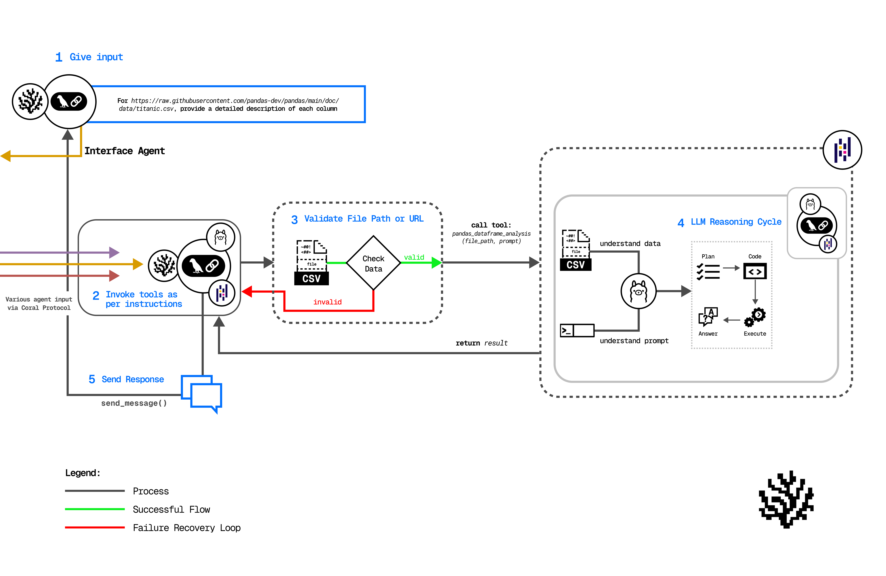

# Vultr Enterprise Spreadsheet Automation
 This guide helps you build an Enterprise Spreadsheet Automation app for the Vultr Challenge using Coral Protocol and multi-agent collaboration. Follow step-by-step setup instructions for agents, server, and UI.



### Introduction

- The Vultr Track challenges you to build a web-based enterprise AI agent deployed on Vultr’s cloud infrastructure using the Coral Protocol, an open, standardized framework for AI agent collaboration. Coral enables multiple AI agents to communicate, share tasks, and coordinate through a structured messaging layer with threads and mentions. 

- The purpose of this track is is to show how to setup and run Coral using Vultr Cloud and a simple demonstration of an agentic system to answer any queries with respect to any spreadsheet. The app reqquires either a spreadsheet and a folder path or upload in Drive or GitHub and provide a public URL.

- In this example we are using the Titanic spreadsheet: `https://raw.githubusercontent.com/pandas-dev/pandas/main/doc/data/titanic.cs`.

- Agents:  [Coral Interface Agent](https://github.com/Coral-Protocol/Coral-Interface-Agent) | [Coral Pandas Agent](https://github.com/Coral-Protocol/Coral-Pandas-Agent) | [Coral ACIdev agent](https://github.com/Coral-Protocol/Coral-AciDevMCP-Agent/tree/pydantic-ai)

- [Demo video](https://drive.google.com/file/d/1JlGDdraESduyIm44QvnJT2aiUzaRoi02/view?usp=sharing)

### Outline

- **Setup Vultr**  
   Step-by-step guide to setup Vultr 

- **Setup Coral Server**  
  Step-by-step guide to install and run Coral Server with necessary dependencies (Java).

- **Setup the Agents**  
  Instructions to install and configure the agents.

- **Run the Agents**  
  Available options to run agents:
  - Dev Mode (terminal-based) for easier debugging  

- **Example**  
  Sample input and output to get results.

### How to run step by step

### 1. Set up Vultr

<details>

- Sign up on Vultr and know more by looking into the [product documentation](https://docs.vultr.com/products)

- Choose and host an instance as per your system requirements (Ubuntu: 22.0.4 recommended)


- Open terminal in your laptop, SSH into the instance (check IP) and enter the password of your instance

```bash
ssh root@95.179.233.169
```
- It is also useful to connect to same instance by [WinSCP](https://winscp.net/eng/index.php) which can help edit files within your server. Connect using your Vultr credentials after installation.


</details>

### 2. Setup Coral Server 

<details>

- After you are logged into Vultr from your terminal, it is time to setup the [Coral Server](https://github.com/Coral-Protocol/coral-server). Follow the steps given in repository to install.

<details>

<summary>Install Java if UNAVAILABLE in order to run Coral Server</summary>

Install Java

```bash

# Apt update
sudo apt update

# Install the JDK
sudo apt install openjdk-17-jdk

# Check version
java -version
```

Run Coral Server

```bash

./gradlew run

```

</details>


</details>

</details>

### 3. Setup the Agents


<details>  

- Terminate the Coral Server from above and start below steps.
- In this example, we are using the agents: [Coral Voice Interface Agent](https://github.com/Coral-Protocol/Coral-VoiceInterface-Agent) , [Coral Pandas Agent](https://github.com/Coral-Protocol/Coral-Pandas-Agent) and [Coral ACIdev agent](https://github.com/Coral-Protocol/Coral-AciDevMCP-Agent/tree/pydantic-ai).  
- Please click on the link and set up the agents by following the setup instructions in the repository.  
- Check the output below to see how the terminal will look after succesfull installation, keep in mind the directory you are at while doing `uv sync`.


</details>

### 4. Run the Agents

<details>

<summary>You can run the agents in dev mode via terminal.</summary>

#### 1. Dev Mode

<details>

- The Dev Mode allows the Coral Server and all agents to be seaprately running on each terminal without UI support.  

- Ensure that the [Coral Server](https://github.com/Coral-Protocol/coral-server) is running on your system and run below commands in separate terminals.

- Ensure that you have setup the `.env` file with required keys.  

Run the Voice Interface Agent

```bash
# cd to directory
cd Coral-VoiceInterface-Agent

# Run the agent using `uv`:
uv run  main.py console
```

Run the Pandas Agent

```bash
# cd to directory
cd Coral-Pandas-Agent

# Run the agent using `uv`:
uv run main.py
```
Run the ACIdev agent 
```bash
#cd to the directory
cd Coral-AciDevMCP-Agent

#Run the agent using 'uv'
uv run main.py
```

</details>

</details>

### 5. Example

<details>

```bash
You have to give a voice input like this
# Input:
ask the pandas agent to describe me the coloums for 'titanic.csv' 

#Output:
The agent will respond back with the column description.

#Input:
then you can ask it to send this information to the ACIdev agent and email to xyz@gmail.com with the subject of Data Description.

#Output:
The email will be sent.

```

</details>

</details>


### Where to find support 

If you have any questions about anything you can join our discord here, and put something in the dev support channel, if you beleivie it to be a bug or a feate that you want you can add it as a github issue https://discord.gg/HaTjdMGBHc
